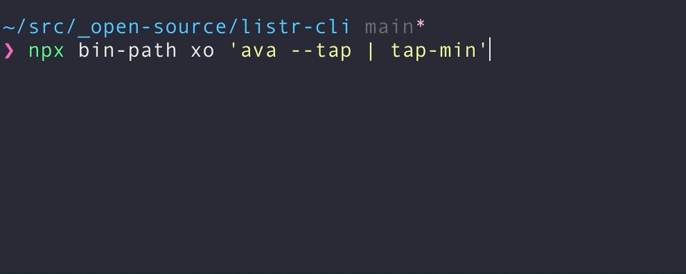

# bin-path-cli

Execute the current package's binary.

<p align="center"></p>

Like using `npm link`, but doesn't add your binary to the global path.

*Demo with [`listr-cli`](https://github.com/tommy-mitchell/listr-cli).*

## Install

```sh
npm install --global bin-path-cli
```

<details>
<summary>Other Package Managers</summary>

```sh
yarn global add bin-path-cli
```
</details>

## Usage

```sh
npx bin-path [source-map] [binary-name] [arguments or flags…]
```

### Curent Working Directory

Inside of a directory with a `package.json` that specifies a binary either via `bin` or `directories.bin`, run via:

```sh
npx bin-path
```

If no binary is found, the `bin-path` command fails.

### Arguments

Flags and arguments are passed as-is to your binary:

```sh
$ npx bin-path --some-flag arg1 arg2
```

<details>
<summary>Example</summary>

```js
// cli.js
#!/usr/bin/env node
import process from "node:process";

const args = process.argv.slice(2);
console.log(`Arguments: [${args.join(", ")}]`);
```

```sh
$ npx bin-path arg1 arg2
#=> "Arguments: [arg1, arg2]"
```
</details>

### Named binaries

If you have multiple exported binaries, they can be accessed by name if passed as the first argument to `bin-path`:

```sh
$ npx bin-path binary-name
```

<details>
<summary>Example</summary>

```jsonc
// package.json
"bin": {
	"foo": "./foo.js",
	"bar": "./bar.js"
}
```

```sh
# `foo` binary
$ npx bin-path foo --foo-flag

# `bar` binary
$ npx bin-path bar --bar-flag
```
</details>

Omitting a name searches for a binary with the same name as the project (i.e. `name` in `package.json`). This is the "default" binary.

<details>
<summary>Example</summary>

```jsonc
// package.json
"name": "foo",
"bin": {
	"foo": "./foo.js",
	"bar": "./bar.js"
}
```

```sh
# `foo` binary
$ npx bin-path --foo-flag
```
</details>

### Source Mapping

If you're writing your binary in a language that compiles to JavaScript (e.g. TypeScript) and would like to test your source binary, you can map the built file to the source file by using the following format as the first argument to `bin-path`:

```sh
$ npx bin-path dist.js:::src.ts
```

<details>
<summary>Example</summary>

```
\__ dist/
    \__ cli.js
\__ src/
    \__ cli.ts
\__ package.json
```

</details>

#### Aliasing

The syntax for mapping to a source binary can be verbose. Adding the following as an alias to your `.zshrc` (or equivalent) could help:

```sh
alias bin-path-map="bin-path dist.js:::src.ts"
```

> [!NOTE]
> The feature is under-tested and the syntax is subject to change. If you have any problems or suggestings, please [file an issue](https://github.com/tommy-mitchell/bin-path-cli/issues/new).

## Related

- [get-bin-path](https://github.com/ehmicky/get-bin-path) - Get the current package's binary path.
